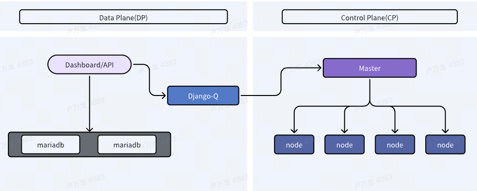

# SmartInfra

[English](README.md) | [简体中文](README-zh.md)

SmartInfra是一个综合性云平台，涵盖计算存储、数据库管理、白盒交换机管理和自动化变更等一系列功能。具体包含以下：
1. SmartInfra作为云平台，可以提供IaaS和PaaS层的计算、存储、负载均衡和持续集成持续发布等资源分配与工具管理

2. **SmartInfra平台作为我们自研硬件网络交换机和网络解决方案的智能大脑，可以实现整个基础网络的自动初始化、自动化配置和自动化运维，大大减轻IT领导者和从业者的负担。同时，我们开创性的提出以租赁设备模式对用户输出服务质量为指标的方式对外合作，真正做到客户是上帝，用的好才是真的好。整个方案中还包含DNS、网盘等配套服务，极致服务客户**

3. SmartInfra平台兼具整个Infra层的统一运维功能，包括系统和网络的CMDB、自动化变更、批量配置等

目前开源的**SmartSalt**是SmartInfra的一个模块，基于 SaltStack进行任务自动化配置和执行的系统。该平台能够标准化、流程化的执行变更配置，支持命令、state剧本、文件分发等操作以异步方式定时或立即执行。执行目标适用于所有开放操作系统的运维和批量操作场景。

平台系统架构如图:



功能清单
------------------------
1. 主机管理，详细展示被纳管主机节点信息。提供定时和手动两种方式刷新节点信息并录入数据库，刷新间隔可自定义，默认为60分钟。同时提供操作（删除/接受/驳回）功能可对节点进行管理

2. 系统管理，系统巧妙设计出一个虚拟角色 - 资源组，将用户-资源组-salt资源进行清晰的多对多关联，使其在操作便捷性和权限严格性方面达成一个很好的协调

3. 认证方式支持三种模式，分别为系统内部认证、Ldap认证和OAuth认证，便捷用户选择自己适配的模式

4. 主机分组，创建主机分组时同时支持salt全选、多次选择单主机、文件上传一次性选择等三种模式，便捷用户的日常操作管理

5. 任务执行，支持命令、state剧本和文件分发等三种执行模式，满足用户的操作需要。同时在执行方式上支持定时和立即执行两种模式，在大批量节点执行场景中是非常匹配和合理的。系统内置的只读策略功能，通过规则匹配，可以将查询非变更型命令免审批执行，在效率和稳定性方面得到改进

6. 全面的审计日志记录，充分满足企业内要求的安全合规工作，保驾护航

快速开始
------------------------
### 系统体验
https://github.com/Dinosaur-Park/heyelb/wiki/Parasaus-Installation-Guide
| 账号 | 密码 |
| --- | --- |
| admin | admin |

### Docker安装
- [安装 Docker](https://download.docker.com/linux/debian/dists/bookworm/pool/stable/amd64/) 

### 平台部署
下载 [docker](docker · smartinfra/smartsalt)目录，进入docker文件夹

```bash
# 启动
docker-compose -f docker-compose.yml up -d

# 表结构初始化
create table...

# 创建管理用户
python3 manage.py createsuperuser

# 退出容器
exit
```

## 访问
http://127.0.0.1


依赖清单
===============
- [Django](https://github.com/django/django)
- [Bootstrap](https://github.com/twbs/bootstrap)
- [jQuery](https://github.com/jquery/jquery)
- [sb-admin-2](https://github.com/BlackrockDigital/startbootstrap-sb-admin-2)
- [ace](https://github.com/ajaxorg/ace)
- [django-q2](https://github.com/django-q2/django-q2)
- [mysqlclient-python](https://github.com/PyMySQL/mysqlclient-python)
- [django-auth-ldap](https://github.com/django-auth-ldap/django-auth-ldap)
- [django-mirage-field](https://github.com/luojilab/django-mirage-field)


贡献代码
===============
可查阅主页的开发计划以及依赖清单，在对应Issues中回复认领，或者直接提交PR，感谢你对SmartInfra的贡献

贡献包括但不限于以下方式：
- Bug修复
- 新功能提交
- 代码优化
- 测试用例完善

交流反馈
===============
- 使用咨询、需求沟通：[Discussions](https://github.com/hhyo/Archery/discussions)
- Bug提交：[Issues](https://github.com/hhyo/archery/issues)